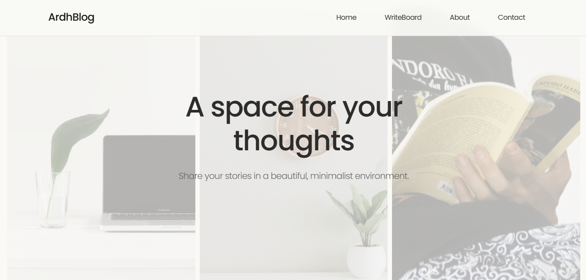

# ArdhBlog



**ArdhBlog** adalah platform blog minimalis yang mengutamakan keindahan tipografi dan fotografi. Dengan tampilan yang bersih dan fitur intuitif, ArdhBlog adalah tempat sempurna untuk menuangkan ide dan cerita Anda.

## 🌟 Demo

[🔗 Lihat Demo di GitHub Pages](https://dhosptn.github.io/ArdhBlog/)

---

## 📋 Fitur

- **Responsive Design**: Tampilan optimal di perangkat apa pun.
- **WriteBoard**: Tulis dan terbitkan cerita langsung.
- **Hero Section**: Grid gambar menarik untuk memikat pembaca.
- **Featured Posts**: Highlight cerita unggulan Anda.
- **Masonry Gallery**: Galeri foto dengan tata letak modern.
- **Contact Form**: Formulir kontak interaktif dengan konfirmasi sukses.

---

## 📂 Struktur Direktori

```
.
├── assets/
│   ├── image/
├── styles/
│   ├── style.css
├── script/
│   ├── script.js
├── index.html
└── README.md
```

---

## 🚀 Cara Menjalankan

1. Clone repository:
   ```bash
   git clone https://github.com/dhosptn/ardhblog.git
   cd ardhblog
   ```
2. Buka file `index.html` di browser Anda.

---

## 📜 Teknologi yang Digunakan

- **HTML5**
- **CSS3**
- **Bootstrap 5**
- **JavaScript (ES6)**

---

## 🤝 Kontribusi

Kami menerima kontribusi dari siapa pun! Ikuti langkah berikut:

1. Fork repository ini.
2. Buat branch fitur baru:
   ```bash
   git checkout -b fitur-keren-anda
   ```
3. Commit perubahan Anda:
   ```bash
   git commit -m "Menambahkan fitur keren"
   ```
4. Push ke branch Anda:
   ```bash
   git push origin fitur-keren-anda
   ```
5. Ajukan pull request.

## 📧 Kontak

Untuk pertanyaan lebih lanjut, hubungi kami di **ahmadridhoseptian388@email.com**.

---

&copy; 2025 ArdhBlog. All rights reserved.
